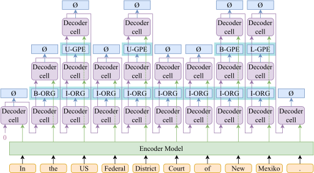

# NameTag 2

This is a named entity recognition (NER) tool NameTag 2.

---



<h3 align="center"><a href="https://aclanthology.org/P19-1527/">Neural Architectures for Nested NER through Linearization</a></h3>

<p align="center">
  <b>Jana Straková</b> and <b>Milan Straka</b> and <b>Jan Hajič</b><br>
  Charles University<br>
  Faculty of Mathematics and Physics<br>
  Institute of Formal and Applied Lingustics<br>
  Malostranské nám. 25, Prague, Czech Republic
</p>

**Abstract:** We propose two neural network architectures for nested named entity recognition (NER), a setting in which named entities may overlap and also be labeled with more than one label. We encode the nested labels using a linearized scheme. In our first proposed approach, the nested labels are modeled as multilabels corresponding to the Cartesian product of the nested labels in a standard LSTM-CRF architecture. In the second one, the nested NER is viewed as a sequence-to-sequence problem, in which the input sequence consists of the tokens and output sequence of the labels, using hard attention on the word whose label is being predicted. The proposed methods outperform the nested NER state of the art on four corpora: ACE-2004, ACE-2005, GENIA and Czech CNEC. We also enrich our architectures with the recently published contextual embeddings: ELMo, BERT and Flair, reaching further improvements for the four nested entity corpora. In addition, we report flat NER state-of-the-art results for CoNLL-2002 Dutch and Spanish and for CoNLL-2003 English.

---

NameTag 2 can be used either as a commandline tool (see the instructions at https://github.com/ufal/nametag/tree/nametag2) or by requesting NameTag webservice (http://lindat.mff.cuni.cz/services/nametag). You can also run your own NameTag server.

Homepage: https://ufal.mff.cuni.cz/nametag

Web service and demo: http://lindat.mff.cuni.cz/services/nametag/

Sources: https://github.com/ufal/nametag/tree/nametag2

Contact: strakova@ufal.mff.cuni.cz

## License

Copyright 2021 Institute of Formal and Applied Linguistics, Faculty of Mathematics and Physics, Charles University, Czech Republic.

This Source Code Form is subject to the terms of the Mozilla Public License, v. 2.0. If a copy of the MPL was not distributed with this file, You can obtain one at http://mozilla.org/MPL/2.0/.

## Please Cite as

```
@inproceedings{strakova-etal-2019-neural,
    title = "Neural Architectures for Nested {NER} through Linearization",
    author = "Strakov{\'a}, Jana  and
      Straka, Milan  and
      Hajic, Jan",
    editor = "Korhonen, Anna  and
      Traum, David  and
      M{\`a}rquez, Llu{\'\i}s",
    booktitle = "Proceedings of the 57th Annual Meeting of the Association for Computational Linguistics",
    month = jul,
    year = "2019",
    address = "Florence, Italy",
    publisher = "Association for Computational Linguistics",
    url = "https://aclanthology.org/P19-1527",
    doi = "10.18653/v1/P19-1527",
    pages = "5326--5331",
}
```

## Requirements

The software has been developed and tested on Linux. You'll need a machine with AVX instructions for serving BERT embeddings (see below).

## Installation

### Clone the NameTag 2 GIT Repository

```sh
git clone https://github.com/ufal/nametag -b nametag2
```

### Get TensorFlow 1.12

You will need Python virtual environment with TensorFlow 1.12 either on CPU or GPU.

#### TensorFlow on CPU

Create a Python virtual environment with TensorFlow 1.12 called `venv-tf-1.12-cpu` in the root of this directory:

```sh
python3 -m venv venv-tf-1.12-cpu
venv-tf-1.12-cpu/bin/pip3 install -r requirements.txt
```

The `nametag2.py` script is then called using the Python installed in your virtual environment, which now contains also the appropriate version of TensorFlow.

#### TensorFlow on GPU

If you plan to scale up for larger experiments or greater speed, you can use the TensorFlow GPU version. You need to install Python virtual environment with GPU TensorFlow version.

### Download the NameTag 2 Models

Download the [latest version of NameTag 2 models](https://ufal.mff.cuni.cz/nametag/2#models).

### Get WEmbedding Service

NameTag 2 is using contextualized BERT embeddings computed by [Transformers](https://arxiv.org/abs/1910.03771) from [Hugging Face](https://github.com/huggingface/transformers).

To this end, we issued a webservice serving transformers BERT embeddings called [WEmbedding service](https://github.com/ufal/wembedding_service). Adding WEmbeddings service as a submodule, a clone command should be:

```sh
git clone --recurse-submodules
```

and/or at later stages (in existing clones):

```sh
git submodule update --init
```

Then install Python `venv` using `requirements.txt` inside the submodule (see also [WEmbeddings README](https://github.com/ufal/wembedding_service)):

```sh
cd wembedding_service
python3 -m venv venv
venv/bin/python3 install -r requirements.txt
```

This will allow you to run the WEmbeddings server which will serve the BERT embeddings to NameTag 2:

```sh
venv/bin/python3 ./start_wembeddings_server.py 8000
```

The first request will take some time, as the models are loaded.

## Running NER Prediction with NameTag 2

Before you run NameTag 2 for NER prediction, please make sure you have:

1. installed Python virtual environment,
2. downloaded the NameTag 2 models,
3. you have an ip:port of a running BERT WEmbeddings service

The main NameTag 2 script is called `nametag2.py`. Example NER prediction usage:

```sh
venv-tf-1.12-cpu/bin/python3 nametag2.py --test_data=examples/en_input.conll --predict=models/english-conll-200831 --bert=localhost:8000
```

Example usage with more documentation on input and output formats can be found in the `nametag2.py` script.

## Training NameTag 2

The main NameTag 2 script `nametag2.py` can be used for training a custom corpus. It will do so when provided the parameters `--train_data`. Optionally, `--dev_data` can be provided and other training parameters that control the training.

The input data file format is a vertical file, one token and its label per line, separated by a tabulator; sentences delimited by newlines (such as a first and fourth column in a well-known CoNLL-2003 IOB shared task corpus). An example of such input file can be found in `nametag2.py` and in `examples/en_gold.conll`.

Example usage:

```sh
venv-tf-1.12-cpu/bin/python3 nametag2.py --threads=4 --batch_size=4 --train_data=train.conll --dev_data=dev.conll --epochs=10:1e-3,8:1e-4 --save_checkpoint=my_models --bert_train=train_bert.npz --bert_dev=dev_bert.npz
```

While it is technically possible to compute the BERT embeddings on demand for each shuffled batch in each step, we strongly recommend to precompute the BERT embeddings as numpy arrays, one array per each token in your vertical CoNLL-like file and store these as npz files. The argument `--bert_train` and `--bert_dev` will load the precomputed BERT embeddings from the npz file and reuse them during training, speeding up the training process. 

## NameTag 2 Server

See `nametag2_server.py`.

The mandatory arguments are given in this order:

- port
- WEmbeddings server (host:port)
- default model name
- each following triple of arguments defines a model, of which
  - first argument is the model name
  - second argument is the model directory
  - third argument are the acknowledgements to append

Example server usage:

```sh
venv/bin/python nametag2_server.py 8001 localhost:8000 czech-cnec2.0-200831 czech-cnec2.0-200831 models/czech-cnec2.0-200831/ ack-text
```

## Docker

Initialize the WEmbeddings service git submodule:

```sh
git clone --recurse-submodules
```

and/or at later stages (in existing clones):

```sh
git submodule update --init
```

Build the WEmbeddings Docker image:

```sh
cd wembedding_service
docker build -t wembeddings
```

Create a user network and start WEmbedding service, connecting to the network:

```sh
docker network create wembeddings-network
docker run --network wembeddings-network --name wembeddings -d --rm wembeddings 8000
```

Then build also the NameTag2 Docker image:

```sh
docker build -t nametag:2.0.0 .
```

Run NameTag2, connecting to the same network:

```sh
docker run --net wembeddings-network --name nametag2 --rm nametag:2.0.0 --test_data=examples/en_input.conll --predict=nametag2-models-200831/english-conll-200831 --bert=wembeddings:8000
```

The first request will take some time, as the models are loaded.
